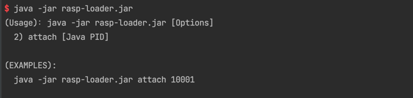
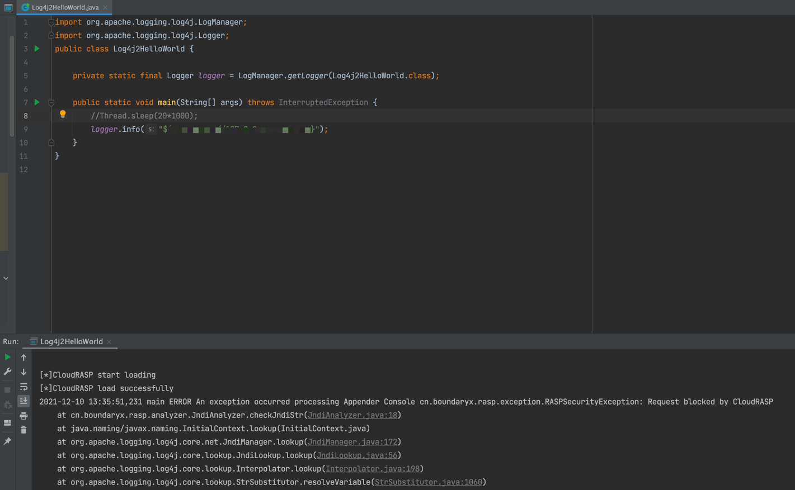

# 靖云甲·应用程序自我防护模块 - Log4j2 专版

[English](README_EN.md)

*本项目为靖云甲为 Log4j2 CVE-2021-44228 专项构建的本地版本。使用不需要联网。*

**请务必测试后再应用于生产环境！**

应用程序自我防护模块通过 RASP 技术，将探针注入至 Java 应用中。对 log4j2 的攻击检测是通过检测程序上下文来实现的，也可为非 Web 业务程序提供保护。

该防御模块会默认阻断通过 log4j2 发起的 JNDI 注入。

值得注意的是 虽然 Oracle 在 6u211、7u201、8u191、11.0.1 默认不再通过 JNDI 加载远程 class，但是攻击人员发现通过 tomcat-el 等第三方组件还是能完成远程命令执行操作。 


## 安装方式

该项目包括两个 JAR 包，```rasp-loader.jar``` 与 ```rasp-core.jar```，已经编译至 ```dist``` 中

其中防护模块的安装支持重启和不重启安装。

### 重启安装

在 Java 程序启动启动脚本添加参数 ```-javaagent:rasp-loader.jar```

以 SpringBoot 程序为例，修改启动参数为 ```java -javaagent:rasp-loader.jar -jar springboot.jar ```

### 不重启安装

执行 ```java -jar rasp-loader.jar``` 然后根据提示注入特定的 JVM 进程



## 阻断测试



## 源码编译

执行 ```build.sh``` 即可

## 版本兼容

支持 JDK 6-16 版本
