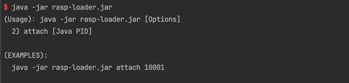

# CloudArmor · Runtime Application Self-Protection Module - Log4j2 Version

[简体中文](README.md)

The application self-defense module uses RASP technology to inject probes into Java applications. The detection of log4j2 is achieved by detecting the execution context, which can also provide protection for non-Web business programs.

The defense module will block JNDI injection initiated through log4j2 by default. 

It is worth noting that although Oracle no longer loads remote classes through JNDI by default in 6u211, 7u201, 8u191, and 11.0.1, attackers have discovered that remote command execution can still be accomplished through third-party components such as tomcat-el. 

## Installation

This project includes two JAR packages, ```rasp-loader.jar``` and ```rasp-core.jar```, which have been compiled to dist.

The self-defense module supports normal and restart-free installation. 

### Normal installation

Append ```-javaagent:rasp-loader.jar``` to Java program startup script argument list

Example: for SpringBoot applications, modify the argument list to append ```java -javaagent:rasp-loader.jar -jar springboot.jar ```


### Restart-free installation

Execute ```java -jar rasp-loader.jar```, and follow the prompts to inject into specific JVM processes 



## Interception test


## Compile from source

Run ```build.sh```

## Compatibility

Support JDK from version 6 to 16 

